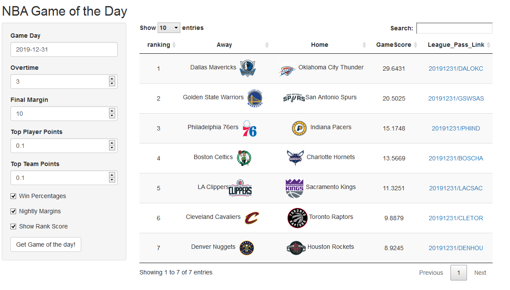

# NBA Game Of The Day
A shiny web application that ranks daily NBA games for your viewing pleasure

This application is primarily designed for those of us outside the USA, who have to watch NBA games on delay due to time zone differences.
This app will show you, based on a formula, which game is going to me most worth your time investment.
Particularly useful if you only have time to watch one game of the night, and you don't want to waste it on the 40 point blowout

Currently in **_alpha_** form, please feel free to submit comments, suggestions, or pull requests

All data comes from the [NBA Stats API](https://stats.nba.com/), and all data and any team logo images belong to the NBA.

 Hopefully one day it will be available online, but currently only local versions work.

## Run your own local version

You can run 'NBA Game of the Day' on your own computer.

To run, start by installing the programming language [R](https://cran.rstudio.com/) and the GUI interface [RStudio](https://rstudio.com/products/rstudio/download/)

Then either clone this repo and run the RunShiny.R script

```
git clone https://github.com/alegione/NBA-Game-Of-The-Day.git
cd NBA-Game-Of-The-Day
Rscript RunShiny.R
```

__OR__ run the below commands in the Rstudio console
```R
packages = c("shiny", "jsonlite", "dplyr", "DT", "curl", "httr")
install.packages(packages, repos = "https://cran.rstudio.com/")
library(shiny)
runGitHub("NBA-Game-Of-The-Day", "alegione")
```

This will download and run the Shiny application locally

## Game Ranking Algorithm

The aim of the ranking system is to assign value to a game based on 'watchability' or 'excitment'. This is hard for numbers alone to achieve but we've given it a go (and open it ideas). Current methodology follows the below basic formula:

```
Number of overtimes x 'Overtime Value' (default: 3) +
'Final Margin Value' - Final game margin + 
Individual player highest points scored x 'Top Player Points Value' (default: 0.1) +
Team highest points scored - 100 x 'Top Team Points Value' (default: 0.1)
```

There are two final score adjustments possible, which can both be utilised at the same time.

1) **Win Percentages:** Multiply final *'Game Rank'* score by the sum of the win percentages of the competing teams.
For example, two teams above .500 will increase the total *'Game Rank'* score
2) **Nightly Margin:** Rather than using an arbitrary value for the *'Final Margin Value'*, replace it with the maximum margin for the night.

## The Interface
The basic features of the interface, and how to run the program are pretty simple. Select the date of the games you want to rank, adjust any parameters, and click on the button. A table will generate ranking all the games of the night. If you adjust any of the parametres from this point, a new table will be generated.



